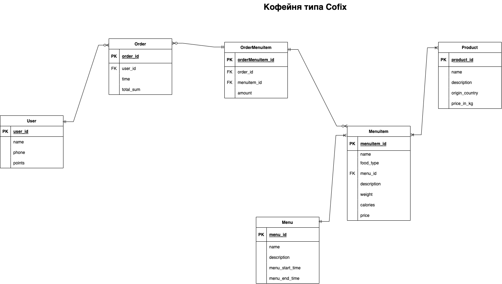

# Новиков Антон Анатольевич, 053502

## 1. Тема: кофейня на основе Cofix (общество с дополнительной ответственностью, сфера услуг)

### Даталогическая модель

| Роли    | Описание          |
| ------- | ----------------- |
| Клиент  | Пользуется сайтом |
| Бариста | Пользуется таблом |

### Сущности:

- **User**

| Название | Описание              | Дополнительная информация                                                                                  |
| -------- | --------------------- | ---------------------------------------------------------------------------------------------------------- |
| user_id  | INT > 0, NOT NULL     | PrimaryKey                                                                                                 |
| name     | VARCHAR(30), NOT NULL |
| phone    | CHAR(10), NOT NULL    | +375 (двузначный код оператора) XXX-XXXX, альтернативный ключ                                              |
| points   | INT > 0, NOT NULL     | баллы начисляются за покупку в эквиваленте 1 BYN = 10 points; возможна покупка в магазине чего-то за баллы |

- **Order**

| Название  | Описание          | Дополнительная информация |
| --------- | ----------------- | ------------------------- |
| order_id  | INT > 0, NOT NULL | PrimaryKey                |
| user_id   |                   | ForeignKey на User        |
| time      | TIME, NOT NULL    |                           |
| total_sum | INT > 0, NOT NULL |                           |

- **OrderMenuitem**

| Название         | Описание          | Дополнительная информация |
| ---------------- | ----------------- | ------------------------- |
| orderMenuitem_id | INT > 0, NOT NULL | PrimaryKey                |
| menuitem_id      |                   | ForeignKey на Menuitem    |
| amount           |                   |                           |

- **Menuitem**

| Название    | Описание          | Дополнительная информация |
| ----------- | ----------------- | ------------------------- |
| menuitem_id | INT > 0, NOT NULL | PrimaryKey                |
| name        | VARCHAR(50)       |                           |
| description | VARCHAR(300)      |                           |
| calories    | INT > 0, NOT NULL |                           |
| price       | INT > 0, NOT NULL |                           |

- **Menu**

| Название        | Описание          | Дополнительная информация |
| --------------- | ----------------- | ------------------------- |
| menu_id         | INT > 0, NOT NULL | PrimaryKey                |
| name            | VARCHAR(50)       |                           |
| description     | VARCHAR(300)      |                           |
| menu_start_time | TIME, NOT NULL    |                           |
| menu_end_time   | TIME, NOT NULL    |                           |

- **Product**

| Название       | Описание          | Дополнительная информация |
| -------------- | ----------------- | ------------------------- |
| product_id     | INT > 0, NOT NULL | PrimaryKey                |
| name           | VARCHAR(30)       |                           |
| description    | VARCHAR(300)      |                           |
| type_id        | VARCHAR(30)       | ForeignKey на Type        |
| origin_country | TIME, NOT NULL    |                           |
| price_in_kg    | INT > 0, NOT NULL |                           |

- **Type**

| Название     | Описание          | Дополнительная информация |
| ------------ | ----------------- | ------------------------- |
| type_id      | INT > 0, NOT NULL | PrimaryKey                |
| product_type | Enum product      |                           |

Enum product (сoffee, dessert)
