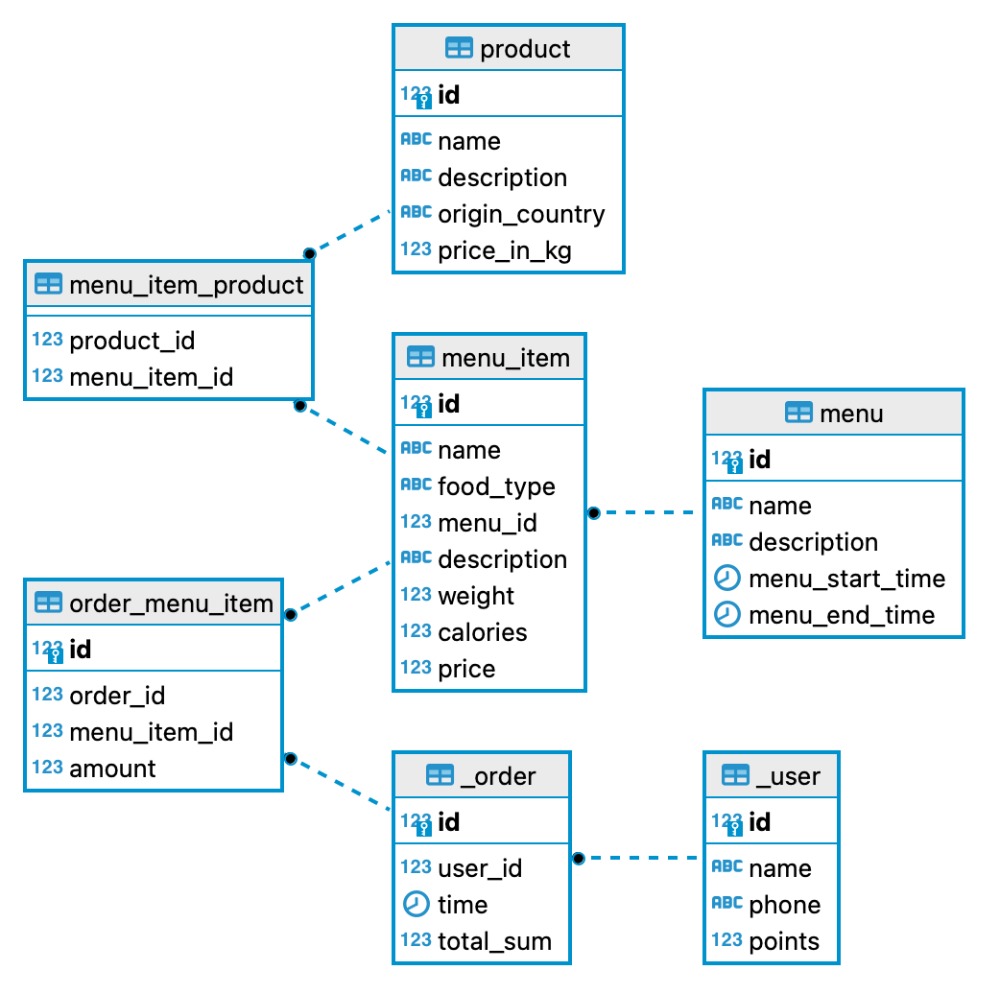

# Новиков Антон Анатольевич, 053502

## 1. Тема: кофейня на основе Cofix (общество с ограниченной ответственностью, сфера услуг)

### Даталогическая модель

| Роли    | Описание          |
| ------- | ----------------- |
| Клиент  | Пользуется сайтом |
| Бариста | Пользуется таблом |

### Сущности:

- **User**

| Название | Описание             | Дополнительная информация                                                                                  |
| -------- | -------------------- | ---------------------------------------------------------------------------------------------------------- |
| user_id  | SERIAL NOT NULL      | PrimaryKey                                                                                                 |
| name     | VARCHAR(30) NOT NULL |
| phone    | CHAR(9) NOT NULL     | +375 (двузначный код оператора) XXX-XXXX, альтернативный ключ                                              |
| points   | INT > 0, NOT NULL    | баллы начисляются за покупку в эквиваленте 1 BYN = 10 points; возможна покупка в магазине чего-то за баллы |

- **Order**

| Название  | Описание          | Дополнительная информация |
| --------- | ----------------- | ------------------------- |
| order_id  | SERIAL NOT NULL   | PrimaryKey                |
| user_id   | INT > 0, NOT NULL | ForeignKey на User        |
| time      | TIME NOT NULL     |                           |
| total_sum | INT > 0, NOT NULL |                           |

- **OrderMenuItem**

| Название         | Описание          | Дополнительная информация |
| ---------------- | ----------------- | ------------------------- |
| orderMenuItem_id | SERIAL NOT NULL   | PrimaryKey                |
| order_id         | INT > 0, NOT NULL | ForeignKey на Order       |
| menuItem_id      | INT > 0, NOT NULL | ForeignKey на MenuItem    |
| amount           | INT > 0, NOT NULL |                           |

- **MenuItem**

| Название    | Описание              | Дополнительная информация |
| ----------- | --------------------- | ------------------------- |
| menuItem_id | SERIAL NOT NULL       | PrimaryKey                |
| name        | VARCHAR(50) NOT NULL  |                           |
| description | VARCHAR(300) NOT NULL |                           |
| calories    | INT > 0, NOT NULL     |                           |
| price       | INT > 0, NOT NULL     |                           |

- **Menu**

| Название        | Описание              | Дополнительная информация |
| --------------- | --------------------- | ------------------------- |
| menu_id         | SERIAL NOT NULL       | PrimaryKey                |
| name            | VARCHAR(50) NOT NULL  |                           |
| description     | VARCHAR(300) NOT NULL |                           |
| menu_start_time | TIME NOT NULL         |                           |
| menu_end_time   | TIME NOT NULL         |                           |

- **Product**

| Название       | Описание              | Дополнительная информация |
| -------------- | --------------------- | ------------------------- |
| product_id     | SERIAL NOT NULL       | PrimaryKey                |
| name           | VARCHAR(30) NOT NULL  |                           |
| description    | VARCHAR(300) NOT NULL |                           |
| product_type   | Enum product_type     |                           |
| origin_country | VARCHAR(30) NOT NULL  |                           |
| price_in_kg    | INT > 0, NOT NULL     |                           |

Enum product_type (сoffee, dessert)

Реализованная база данных ([create.sql](create.sql)):

Функциональные требования к проекту:

- CRUD пользователя
- магазин, в котором можно покупать кофе/десерты за бонусы
- возможность заказа кофе/десерта через сайт
- framework Django
- БД Postgresql

## Теория

Нормальные формы:

- Первая нормальная форма предполагает, что таблица не должна содержать повторяющихся столбцов или таких столбцов, которые содержат наборы значений. Ненормализованная таблица в этом случае может содержать одну или несколько повторяющихся групп данных.

- Во второй нормальной форме каждый столбец в таблице, который не является ключом, должен зависеть от ключа.

- Третья нормальная форма предполагает, что каждый столбец, не являющийся ключом, должен зависеть только от столбца, который является ключом, то есть должна отсутствовать транзитивная функциональная зависимость (transitive functional dependency)
